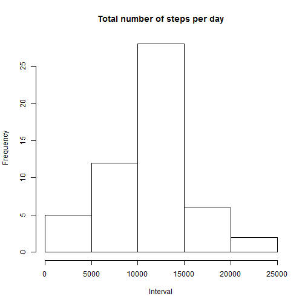
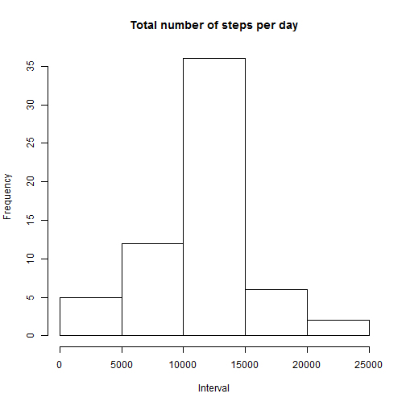
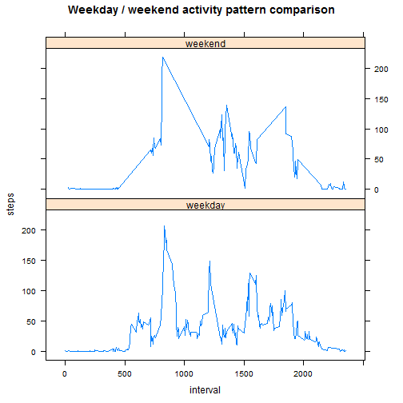

# Reproducible Research: Peer Assessment 1


## Loading and preprocessing the data
### Load the data (i.e. read.csv())

```r
data <- read.csv("activity.csv")
```

### Process/transform the data (if necessary) into a format suitable for your analysis
The date field can be converted in POSIXct format in order to use specific date function.

```r
data$date = as.POSIXct(data$date)
```


## What is mean total number of steps taken per day?
### Make a histogram of the total number of steps taken each day
To have a first idea of the total number of steps taken each day it is useful to produce a histogram:

```r
totalStepsPerDay = aggregate(steps ~ date, data[!is.na(data$steps), ], sum)
hist(totalStepsPerDay$steps, xlab = "Interval", main = "Total number of steps per day")
```

 

### Calculate and report the mean and median total number of steps taken per day
The mean number of steps taken per day is:

```r
mean(totalStepsPerDay$steps)
```

```
## [1] 10766
```

The median number of steps taken per day is:

```r
median(totalStepsPerDay$steps)
```

```
## [1] 10765
```


## What is the average daily activity pattern?
### Make a time series plot (i.e. type = "l") of the 5-minute interval (x-axis) and the average number of steps taken, averaged across all days (y-axis)
To understand the average daily activity pattern it is possible to plot it over the whole period:

```r
meanStepsPerInterval = aggregate(steps ~ interval, data, mean)
with(meanStepsPerInterval, plot(interval, steps, type = "l"), main = "Daily activity pattern")
```

 

### Which 5-minute interval, on average across all the days in the dataset, contains the maximum number of steps?
The interval with, on average, the maximum number of steps is:

```r
intervalMaxSteps = with(meanStepsPerInterval, interval[which(steps == max(steps, 
    na.rm = TRUE))])
intervalMaxSteps
```

```
## [1] 835
```

with number of steps equals to:

```r
maxAvgSteps = meanStepsPerInterval[meanStepsPerInterval$interval == intervalMaxSteps, 
    ]
maxAvgSteps$steps
```

```
## [1] 206.2
```


## Imputing missing values
### Calculate and report the total number of missing values in the dataset (i.e. the total number of rows with NAs)
The number of rows with at least a missing value is:

```r
missingValues = sum(!complete.cases(data))
missingValues
```

```
## [1] 2304
```


### Devise a strategy for filling in all of the missing values in the dataset. The strategy does not need to be sophisticated. For example, you could use the mean/median for that day, or the mean for that 5-minute interval, etc.
To fill the missing values it is possible to substitute them with the average number of steps, at the same interval, on the other days of the same kind (weekday days or weekend days).
### Create a new dataset that is equal to the original dataset but with the missing data filled in
To create the new dataset we define a function that calculates if a day is a weekday day or a weekend day.

```r
isWeekend <- function(date) {
    day <- weekdays(date)
    if (day %in% c("Saturday", "Sunday")) {
        return("weekend")
    } else {
        return("weekday")
    }
}
```

It is now possible to calculate the dataset with the missing values filled in. To do so we use the nvl function (here defined) to get the first not null values of a vector (of length 2) of number.

```r
nvl <- function(vals) {
    print(vals)
    if (!is.na(vals[[1]])) {
        return(vals[[1]])
    } else {
        return(vals[[2]])
    }
}

data$isWeekend <- as.factor(sapply(data$date, isWeekend))
meanStepsPerIntervalWeekday = aggregate(steps ~ interval + isWeekend, data[!is.na(data$steps), 
    ], mean)
dataImputed = merge(data, meanStepsPerIntervalWeekday, by = c("isWeekend", "interval"))
dataImputed$steps = apply(cbind(dataImputed$steps.x, dataImputed$steps.y), 1, 
    nvl)
colnames(dataImputed)
dataImputed = dataImputed[, c(1, 2, 4, 6)]
```


### Make a histogram of the total number of steps taken each day and Calculate and report the mean and median total number of steps taken per day. Do these values differ from the estimates from the first part of the assignment? What is the impact of imputing missing data on the estimates of the total daily number of steps?
It is now possible to compare the values of the dataset with the missing values filled in with the one with the NA, calculated before.The new histogram of the total number of steps taken per day is:

```r
totalStepsPerDayImputed = aggregate(steps ~ date, dataImputed, sum)
hist(totalStepsPerDayImputed$steps, xlab = "Interval", main = "Total number of steps per day")
```

 

The mean of the total number of steps taken per day passes from 1.0766 &times; 10<sup>4</sup> to:

```r
mean(totalStepsPerDayImputed$steps)
```

```
## [1] 10762
```

The median number of steps taken per day passes from 10765 to:

```r
median(totalStepsPerDayImputed$steps)
```

```
## [1] 10571
```

We have then an increase in the mean, while the median decreases.


## Are there differences in activity patterns between weekdays and weekends?
### Create a new factor variable in the dataset with two levels - "weekday" and "weekend" indicating whether a given date is a weekday or weekend day.
To create the factor variable representing if a day is a weekday day or a weekend day it is possible to use the isWeekend function defined above. However, the variable is already present due to the code used to fill the missing values.


### Make a panel plot containing a time series plot (i.e. type = "l") of the 5-minute interval (x-axis) and the average number of steps taken, averaged across all weekday days or weekend days (y-axis). The plot should look something like the following, which was creating using simulated data: 
To better compare the activities during weekday day and weekend days it is possible to visualize the two trends:

```r
meanStepsPerIntervalWeekdayImputed = aggregate(steps ~ interval + isWeekend, 
    dataImputed, mean)
xyplot(steps ~ interval | isWeekend, meanStepsPerIntervalWeekdayImputed, layout = c(1, 
    2), type = "l", main = "Weekday / weekend activity pattern comparison")
```

 

